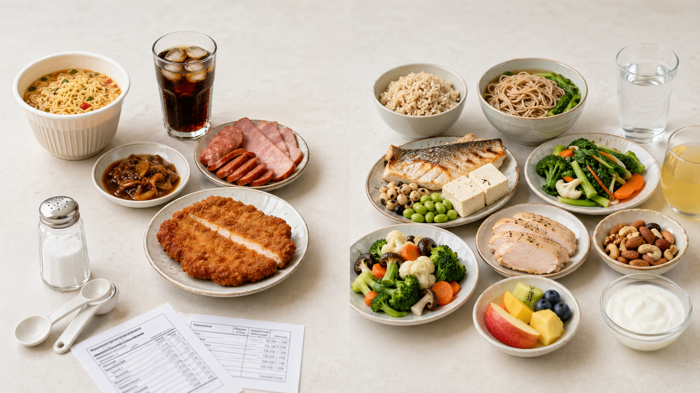
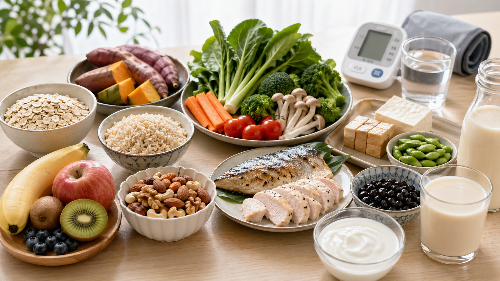
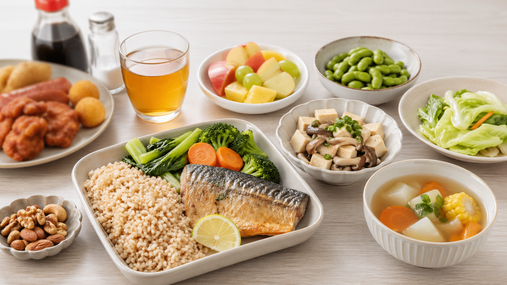

先把得舒飲食（DASH）想成一種「降血壓餐盤」，而不是一張昂貴或特殊的菜單。美國官方衛教資料把它定義成一種彈性、均衡、可長期維持的心臟健康飲食：多吃蔬菜、水果、全穀、低脂或脫脂乳品、魚、禽肉、豆類、堅果與植物油；少吃高飽和脂肪食物、甜飲、甜食與高鈉食物。<a href="#ref-3">[3]</a>

這篇適合想控制血壓、飲食常偏鹹，或同時擔心膽固醇與心血管風險的人。美國最新高血壓指引把得舒飲食列為心臟健康飲食範例；歐洲心臟醫學會的高血壓指引也建議採用地中海飲食或得舒飲食這類健康均衡飲食，以降低血壓與心血管風險。<a href="#ref-1">[1]</a><a href="#ref-5">[5]</a>

## 最重要的一句話

> 得舒飲食的核心不是「只吃水煮餐」，而是把餐盤改成「蔬果多、全穀多、豆堅果適量、低脂乳品、魚禽瘦肉、少鹽、少甜、少飽和脂肪」。

以美國官方 2,000 大卡範例來看，每天目標大約是：全穀或穀類 6-8 份、蔬菜 4-5 份、水果 4-5 份、低脂或脫脂乳品 2-3 份、魚禽瘦肉 6 份以下、油脂 2-3 份；每週堅果、種子、乾豆或豌豆 4-5 份，甜食 5 份以下。鈉的目標是每天 2,300 毫克，若能降到每天 1,500 毫克，血壓可再進一步下降。<a href="#ref-3">[3]</a><a href="#ref-4">[4]</a>

## 為什麼指引會推薦

血壓管理不只是看一次數字，而是把長期心血管風險一起照顧好。美國最新高血壓指引把健康體重、得舒飲食這類心臟健康飲食、減鈉、增加含鉀食物、運動、壓力管理與減少酒精，一起列為生活型態調整的重點。這篇文章只談飲食做法；血壓數字如何判讀、是否需要用藥，請交給醫師依個人狀況評估。<a href="#ref-1">[1]</a>

把許多飲食研究整理起來看，得舒飲食對血壓通常有幫助。整體平均下來，收縮壓和舒張壓都可能下降；但每個人的改善幅度不一樣，會受到原本飲食、體重、鈉攝取、運動習慣和執行程度影響。比較實際的期待是：它不是幾天就見效的神奇菜單，而是值得長期養成的餐盤方向。<a href="#ref-6">[6]</a>

## 你的餐盤可以這樣改

第一步先處理主食：白飯不是不能吃，但可以把一部分換成糙米、燕麥、全麥麵、地瓜、玉米或其他全穀、原型澱粉。得舒飲食的一份穀類，可以簡單想成 1 片吐司，或約半碗煮熟的飯、麵、麥片；多數穀類份量建議以全穀為主。<a href="#ref-4">[4]</a>

第二步把蔬果變成固定班底。蔬菜一份可以是 1 杯生葉菜、半杯煮熟或切好的蔬菜；水果一份可以是 1 顆中型水果、半杯切好的水果，或少量果乾。實務上可先從「午晚餐各半碗到一碗蔬菜、每天 1-2 份水果」開始，再慢慢接近得舒飲食目標。<a href="#ref-4">[4]</a>

第三步重新安排蛋白質。得舒飲食包含魚、去皮禽肉、豆類、低脂或脫脂乳品、堅果與種子；紅肉、加工肉和肥肉不是主角。豆腐、豆乾、毛豆、黑豆、鷹嘴豆、扁豆都很適合拿來替換香腸、培根、五花肉或炸雞。堅果有幫助，但份量要算：一份約是一小把堅果，或 2 湯匙花生醬。<a href="#ref-4">[4]</a>

第四步是減鈉。美國得舒飲食資料常用每天 2,300 毫克作為鈉目標，若能往每天 1,500 毫克靠近，血壓可再進一步下降；衛福部國健署則提醒成人每日鈉總攝取量不要超過 2,400 毫克，約等於食鹽 6 公克。最容易超標的常常不是鹽罐，而是加工食品、湯麵湯底、滷汁、醬料、泡菜、罐頭、火鍋湯、零食和外食。<a href="#ref-3">[3]</a><a href="#ref-8">[8]</a>

## 食物替代可以更具體

主食可以這樣換：白飯、白吐司、白麵條，不必一次全部戒掉，可以先把一半換成糙米、紫米、燕麥、地瓜、南瓜、芋頭、玉米或全麥麵。國健署也建議用未精製全穀雜糧取代精製主食，讓纖維和礦物質多一些。<a href="#ref-4">[4]</a><a href="#ref-11">[11]</a>

蛋白質可以這樣換：香腸、培根、火腿、貢丸、炸雞排、五花肉，改成豆腐、豆乾、毛豆、黑豆、無糖豆漿、魚、蝦、去皮雞肉或少油瘦肉。國健署的健康年菜建議也提到，可以用豆製品、白肉類替代紅肉及加工食品；豆腐泥、洋蔥、紅蘿蔔、香菇等也能拿來取代肥肉，讓料理仍有口感。<a href="#ref-10">[10]</a><a href="#ref-11">[11]</a>

調味可以這樣換：不要只靠鹽、醬油、沙茶醬、番茄醬、辣醬和滷汁撐味道。國健署減鹽資料建議，可用醋、蘋果、鳳梨、番茄增加酸甜；用蒜、薑、洋蔥、香菜、胡椒、八角、花椒、香草等帶出香氣；烹調方式也可多用蒸、烤、燉，保留食物本身的鮮味。<a href="#ref-8">[8]</a><a href="#ref-10">[10]</a>

點心飲料可以這樣換：含糖飲料、奶茶、果汁飲料、餅乾、洋芋片、甜點，改成白開水、無糖茶、無糖豆漿、整顆水果、無調味堅果、毛豆或無糖低脂優格。國健署提醒，日常飲食可掌握少油、少鹽、少糖、多喝開水，也要多選高纖維食物。<a href="#ref-9">[9]</a><a href="#ref-10">[10]</a>

## 少吃什麼

得舒飲食要少的是高鈉、高糖和高飽和脂肪。常見需要減量的食物包括泡麵、鹹酥雞、炸物、加工肉、火腿、培根、香腸、重鹹滷味、濃湯、醬料很多的便當、甜飲、果汁飲料、甜點、奶油、鮮奶油、全脂乳製品、椰子油和棕櫚油。<a href="#ref-2">[2]</a><a href="#ref-3">[3]</a>

如果同時在意壞膽固醇，得舒飲食的方向也對。美國心臟醫學會的飲食文章指出，得舒飲食鼓勵水果、蔬菜、全穀與低脂乳品，限制飽和脂肪、鈉和添加糖；和一般高油鹽糖的飲食相比，得舒飲食對壞膽固醇也可能有小幅幫助。不過對膽固醇來說，重點仍是低飽和脂肪、高纖維、少加工，不能把得舒飲食講成會讓壞膽固醇大幅下降的治療。<a href="#ref-7">[7]</a>

## 一天範例

早餐可以是燕麥加無糖低脂鮮奶或無糖優格，配水果；如果不適合乳品，可和營養師討論鈣質與蛋白質來源。午餐選糙米或五穀飯、兩種蔬菜、豆腐/魚/去皮雞肉，醬汁另外放、湯少喝。晚餐用一半餐盤放蔬菜，四分之一放全穀或原型澱粉，四分之一放豆類、魚或去皮禽肉；點心用水果、無調味堅果、毛豆或無糖優格取代甜飲和餅乾。<a href="#ref-3">[3]</a><a href="#ref-4">[4]</a><a href="#ref-9">[9]</a>

外食時最實用的順序是：先減湯汁和醬料，再減加工肉和炸物，接著把蔬菜加上來。滷味可多選青菜、豆腐、菇類、海帶，少選甜不辣、貢丸、香腸、滷汁和辣油；便當可請店家飯少一點、菜多一點、醬少一點，主菜優先選烤、滷、蒸、煮，少選炸排骨和三杯重醬。湯麵類可以改成乾麵少醬加燙青菜，或湯另放、少喝湯；火鍋可多選原型肉片、豆腐、菇類、蔬菜，少選火鍋料和沾醬。<a href="#ref-8">[8]</a>

## 什麼情況要和醫師討論

如果醫師已經告訴你有高血壓，或你有心肌梗塞、中風、糖尿病、慢性腎臟病、心衰竭、懷孕相關高血壓，請不要只靠飲食自己觀察。得舒飲食可以當作生活型態基礎，但是否需要藥物、追蹤頻率與血壓目標，應依你的年齡、共病、用藥和整體風險由醫師判斷。<a href="#ref-1">[1]</a>

另外，想靠「高鉀」幫助血壓前要小心。蔬菜、水果、豆類是得舒飲食的重要食物，但如果有腎臟病，或正在使用某些降血壓藥或利尿劑，請先和醫師確認，不要自行大量補鉀或換成高鉀鹽。<a href="#ref-5">[5]</a>

## 給自己的三個小目標

第一，這週先把家裡的泡麵、鹹零食、甜飲和加工肉減半。第二，每天至少讓一餐有「全穀主食、兩種蔬菜、一份豆類或魚禽瘦肉」。第三，買東西看鈉含量和飽和脂肪，煮飯時用蔥、薑、蒜、洋蔥、菇類、番茄、檸檬、醋和香辛料增加味道，讓調味回到食物本身，而不是靠醬料撐起整餐。<a href="#ref-8">[8]</a><a href="#ref-10">[10]</a>

重點不是吃得很完美，而是讓每天的餐盤慢慢往得舒飲食靠近：蔬果多一點、全穀多一點、豆類堅果剛剛好、鹽和甜少一點、飽和脂肪少一點。這樣的改變，才是指引真正想讓人帶回家的生活方式。<a href="#ref-3">[3]</a><a href="#ref-4">[4]</a>

## 主要來源

<ol>
  <li id="ref-1">美國心臟學會。<a href="https://professional.heart.org/en/science-news/2025-high-blood-pressure-guideline/top-things-to-know">2025 年高血壓指引重點整理</a>。更新日期：2025/08/14。</li>
  <li id="ref-2">美國心臟醫學會。<a href="https://www.acc.org/About-ACC/Press-Releases/2025/08/13/20/03/New-high-blood-pressure-guideline-emphasizes-prevention-early-treatment-to-reduce-CVD-risk">2025 年高血壓指引新聞稿</a>。發布日期：2025/08/13。</li>
  <li id="ref-3">美國國家心肺血液研究所。<a href="https://www.nhlbi.nih.gov/health/dash-eating-plan">得舒飲食介紹</a>。更新日期：2026/02/25。</li>
  <li id="ref-4">美國國家心肺血液研究所。<a href="https://www.nhlbi.nih.gov/health/dash/following-dash">得舒飲食份量表</a>。更新日期：2026/02/25。</li>
  <li id="ref-5">歐洲心臟醫學會。<a href="https://academic.oup.com/eurheartj/article/45/38/3912/7741010">2024 年血壓與高血壓照護指引</a>. Eur Heart J. 2024;45(38):3912-4018.</li>
  <li id="ref-6">Saneei P, et al. <a href="https://www.ncbi.nlm.nih.gov/books/NBK292159/">得舒飲食與血壓的研究整理</a>. Nutr Metab Cardiovasc Dis. 2014;24(12):1253-1261.</li>
  <li id="ref-7">美國心臟醫學會。<a href="https://www.acc.org/Latest-in-Cardiology/Articles/2025/07/01/01/Prioritizing-Health-Dietary-Approaches-For-Elevated-LDL-C">飲食與壞膽固醇控制</a>。2025。</li>
  <li id="ref-8">衛生福利部國民健康署。<a href="https://www.hpa.gov.tw/Pages/Detail.aspx?nodeid=1161&pid=6648">減鹽秘笈手冊</a>。更新日期：2026/01/23。</li>
  <li id="ref-9">衛生福利部國民健康署。<a href="https://www.hpa.gov.tw/Pages/Detail.aspx?nodeid=543&pid=8365&sid=718">正確飲食習慣</a>。更新日期：2021/10/21。</li>
  <li id="ref-10">衛生福利部國民健康署。<a href="https://www.hpa.gov.tw/Pages/Detail.aspx?nodeid=4878&pid=18762">飲食5撇步 聰明吃年菜</a>。發布日期：2025/01/14。</li>
  <li id="ref-11">衛生福利部國民健康署。<a href="https://www.hpa.gov.tw/Pages/Detail.aspx?nodeid=5020&pid=19841">「植」感創意年菜迎新春 兼顧營養美味和低碳永續</a>。發布日期：2026/02/10。</li>
</ol>
