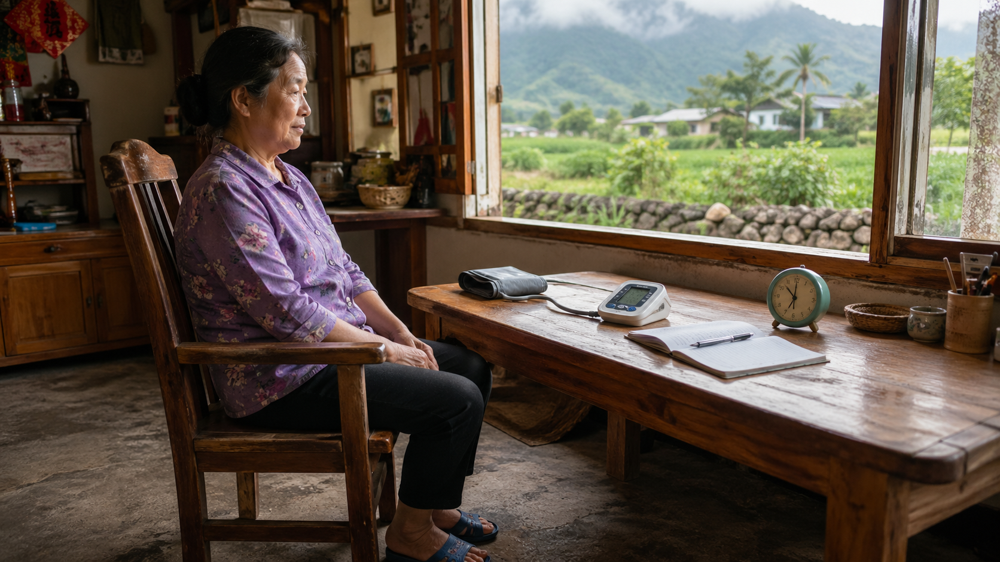
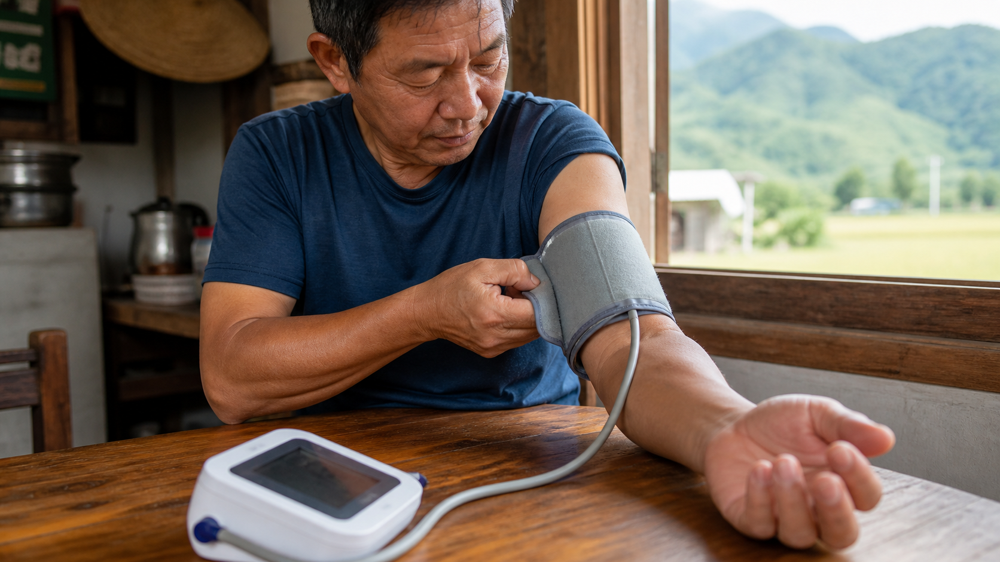
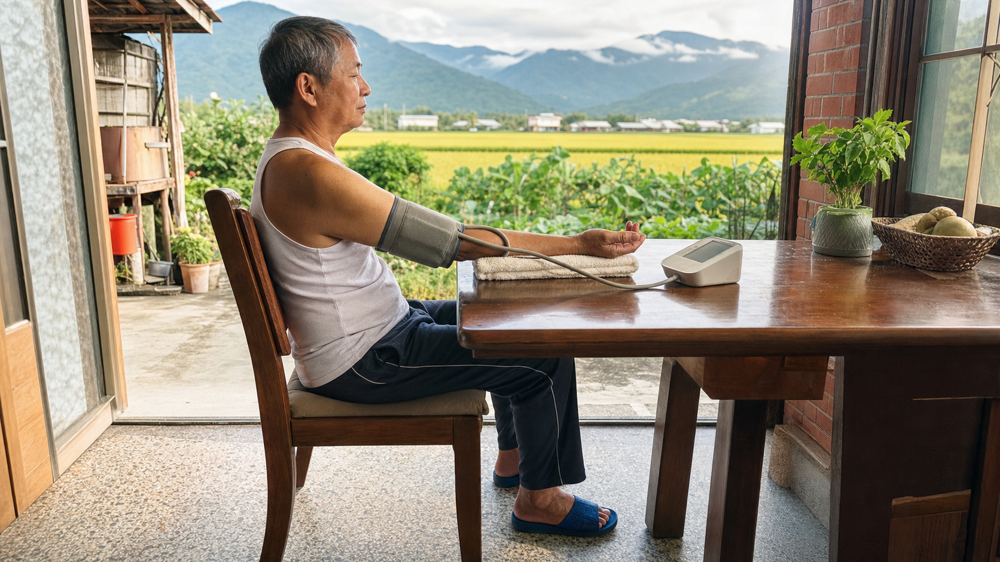
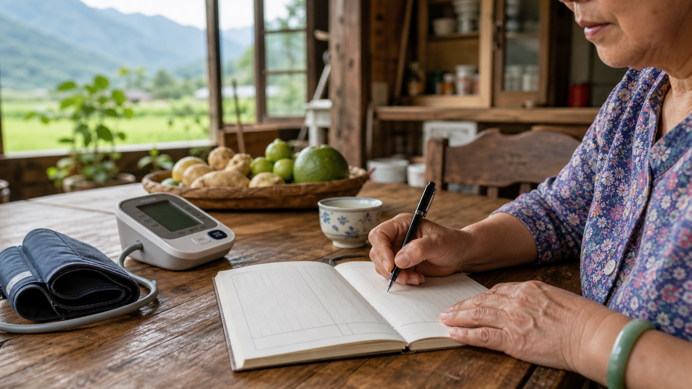

高血壓最需要被認真對待的地方，不是它每次都會讓人不舒服，而是它常常沒有感覺。WHO 和 CDC 都提醒，多數高血壓的人平常不一定會頭痛、頭暈或胸悶；量血壓，才是知道自己血壓狀況的關鍵方法。<a href="#ref-3">[3]</a><a href="#ref-4">[4]</a>

這篇的量測方法，以台灣心臟學會與台灣高血壓學會（TSOC/THS）的 2022 年高血壓治療指引，以及 2020 年居家血壓量測共識為主。你提供的宣導影片《聰明量血壓 保護心健康》很適合當作操作提醒；本文的醫療文字仍回到 TSOC/THS 指引與共識。其他國外資料只用來補充「為什麼要量」和高血壓可能造成的併發症。<a href="#ref-1">[1]</a><a href="#ref-2">[2]</a><a href="#ref-7">[7]</a>

## 最重要的一句話

> 高血壓不是「有感覺才危險」；可靠的連續血壓紀錄，才是判斷風險與調整治療的基礎。

單次診間血壓會受到緊張、趕時間、講話、姿勢、袖帶大小、剛喝咖啡或剛運動影響。TSOC/THS 指引特別強調居家血壓監測，因為它比較容易避開診間環境與情緒壓力，也能記錄較長期的血壓變化，和高血壓造成的器官傷害與心血管事件更相關。<a href="#ref-1">[1]</a>

## 為什麼要量血壓

第一，因為高血壓常常沒有警訊。CDC 說，高血壓通常沒有警告症狀，很多人不知道自己有高血壓；WHO 也說，知道血壓是否偏高的方法，就是把血壓量出來。<a href="#ref-3">[3]</a><a href="#ref-4">[4]</a>

第二，因為「在診間高」和「在家也高」意義不一樣。有些人到診間會緊張，形成白袍高血壓；也有人診間看起來還好，在家或日常生活中卻偏高，也就是隱性高血壓。TSOC/THS 的居家血壓共識指出，居家血壓可以幫忙確認診間血壓、辨識高血壓型態、協助治療調整，並改善血壓控制。<a href="#ref-2">[2]</a>

第三，因為治療不是看一筆數字。醫師需要知道你平常早上、晚上、吃藥前後、生活作息中的趨勢，才比較能判斷是否需要調整藥物、是否控制穩定，或是否有低血壓與用藥時間的問題。<a href="#ref-1">[1]</a><a href="#ref-2">[2]</a>

## 高血壓會傷到哪裡

高血壓長期沒有控制時，血管壁承受的壓力會一直偏高，身體常常是慢慢受傷，而不是突然有感覺。AHA 把未偵測、未控制的高血壓可能造成的問題列得很清楚：心肌梗塞、中風、心臟衰竭、腎臟病或腎衰竭、視力受損、性功能障礙、心臟病和動脈粥樣硬化。<a href="#ref-5">[5]</a>

用器官來記會比較好懂：

- 心臟：血壓高會讓心臟長期用力工作，可能造成心絞痛、心肌梗塞、心臟衰竭，或心律不整風險上升。<a href="#ref-3">[3]</a><a href="#ref-5">[5]</a>
- 腦部：供應腦部的血管可能阻塞或破裂，造成中風；中年時期高血壓也和日後認知功能變差、失智風險較高有關。<a href="#ref-4">[4]</a>
- 腎臟：高血壓會傷害腎臟周圍與腎臟內的血管，讓腎臟過濾功能變差，嚴重時可能走向腎衰竭。<a href="#ref-3">[3]</a><a href="#ref-5">[5]</a>
- 眼睛與全身血管：眼底小血管、周邊動脈與全身動脈都可能受影響，增加視力受損和動脈硬化相關問題。<a href="#ref-4">[4]</a><a href="#ref-5">[5]</a>

## TSOC/THS 建議的完整量測姿勢

居家血壓不是把袖帶套上去、按下按鈕就好。TSOC/THS 指引把量測分成準備、設備與姿勢、實際量測、紀錄與平均幾個步驟；只要其中一個環節沒做好，數字就可能被高估或低估。<a href="#ref-1">[1]</a><a href="#ref-2">[2]</a>

先選對工具。TSOC/THS 建議使用經過驗證的上臂式電子血壓計，袖帶大小要適合自己的手臂圍；腕式和手指式血壓計因可靠性較不理想，不建議作為一般居家追蹤的主要工具。2022 指引也提醒，血壓計應依建議定期校正，至少每 12 個月一次。<a href="#ref-1">[1]</a><a href="#ref-2">[2]</a>

### 1. 量之前：先讓身體回到安靜狀態

量血壓前 30 分鐘，避免咖啡因、運動和抽菸；2020 共識也提醒不要在喝酒、剛吃飽或激烈活動後立刻量。量之前先排空膀胱，選一個安靜、溫度舒適的位置坐下。<a href="#ref-1">[1]</a><a href="#ref-2">[2]</a>

坐下後先休息至少 5 分鐘。這段時間不要滑手機到很激動、不要講話、不要邊量邊聊天，也不要急著連續按好幾次。血壓本來就會被情緒、活動和姿勢拉動，先安靜下來，數字才比較能代表平常狀態。<a href="#ref-1">[1]</a><a href="#ref-2">[2]</a>

*量前先坐穩休息，準備好血壓計、壓脈帶與紀錄工具。場景不必像診間，只要安靜、穩定、能正確支撐身體和手臂。*

### 2. 坐姿：背靠好，腳放平，手臂有支撐

TSOC/THS 建議坐在有椅背的椅子上，背部靠好，雙腳平放地面，不要翹腳，也不要讓腳懸空。身體坐穩後，把要量測的手臂放在桌面或平面上支撐，不要自己懸空出力。<a href="#ref-1">[1]</a><a href="#ref-2">[2]</a>

手臂高度很重要。袖帶中間的位置應該大約在右心房高度，也就是接近胸骨中點、心臟高度。如果桌子太低，手臂垂著量，數字可能不準；如果桌子太高，肩膀聳起來，身體也會用力。可以用枕頭或折好的毛巾把前臂墊到舒服的位置。<a href="#ref-1">[1]</a><a href="#ref-2">[2]</a>

### 3. 袖帶：裸臂、上臂、位置對準肱動脈

袖帶要包在裸露的上臂，不要隔著衣服量。也不要把袖子硬捲到上臂，因為捲起來的衣服可能勒住手臂，形成類似止血帶的效果。<a href="#ref-1">[1]</a>

袖帶大小要照血壓計廠商說明選擇，不能太小也不能太大。TSOC/THS 指引提到，袖帶氣囊寬度和長度至少應分別涵蓋上臂圍的 40% 和 80%；2020 共識也提醒，氣囊長度最好能覆蓋手臂圍的 80%-100%。<a href="#ref-1">[1]</a><a href="#ref-2">[2]</a>

放置袖帶時，袖帶中心要對準上臂的肱動脈，袖帶下緣約在手肘皺摺上方 2.5 公分，也就是大約兩指寬的位置。管線自然垂放即可，不需要拉緊。<a href="#ref-1">[1]</a>

*壓脈帶要直接包在裸露上臂，位置不要太靠近手肘，也不要隔著衣服或被袖子勒住。*

### 4. 量的時候：不要說話、不要動，每次間隔 1 分鐘

按下開始後，保持安靜，不說話、不移動、不握拳、不看會讓自己緊張的內容。每個時段至少量 2 次，兩次之間間隔 1 分鐘；如果有心房顫動，TSOC/THS 指引建議每個時段至少量 3 次，並使用適合心房顫動族群的驗證設備。<a href="#ref-1">[1]</a><a href="#ref-2">[2]</a>

*量測中不要說話或移動；手臂要放鬆、有支撐，壓脈帶高度接近心臟。*

第一次建立紀錄時，可以左右上臂都量。TSOC/THS 指引提到，若兩手臂收縮壓差距小於 15 mmHg，後續可用數值較高的那一側追蹤；若差距很明顯，請帶紀錄回診討論。<a href="#ref-1">[1]</a>

### 5. 記錄：收縮壓、舒張壓、心跳都留下來

每次量完，請記錄收縮壓、舒張壓和心跳，也把日期、早上或晚上、是否吃藥、是否剛運動或身體不舒服一起記下來。若血壓計能自動儲存或傳輸資料很好，但回診時仍建議整理成醫師容易看的表格。<a href="#ref-1">[1]</a><a href="#ref-2">[2]</a>

*量後把每一筆都留下來，不要只挑最低或最高的數字。回診時，趨勢比單筆數字更有幫助。*

## 記住 722 原則

TSOC/THS 的居家血壓核心是「722」：

- 7：連續量 7 天；若真的做不到，至少 4 天。<a href="#ref-1">[1]</a><a href="#ref-2">[2]</a>
- 2：每天量 2 個時段，早上和晚上。<a href="#ref-1">[1]</a><a href="#ref-2">[2]</a>
- 2：每個時段至少量 2 次，每次間隔 1 分鐘。若有心房顫動，TSOC/THS 建議每個時段至少 3 次，並使用適合心房顫動族群的驗證設備。<a href="#ref-1">[1]</a>

早上那次，建議在起床後 1 小時內、排尿後、吃早餐與吃藥前量；晚上那次，建議在睡前 1 小時內量。不要只挑最低的一筆或最高的一筆給醫師看，請把每次數字都記下來。TSOC/THS 指引計算平均時，會排除第 1 天的讀數，再看早上與晚上的平均。<a href="#ref-1">[1]</a><a href="#ref-2">[2]</a>

## 什麼時候要量一輪

如果血壓狀態還不清楚，或醫師想確認是否真的有高血壓，可以做一輪 722。開始降血壓藥或調整藥物後，TSOC/THS 也建議約 2 週後再做居家血壓監測；控制不佳時可較密集，例如每月一輪，控制穩定時可每 3 個月一輪。穩定很久的人，也可以和醫師討論用每週一次、每次兩筆的方式維持追蹤習慣。<a href="#ref-1">[1]</a><a href="#ref-2">[2]</a>

2022 台灣指引已把標準化居家血壓放在很重要的位置，並採用 130/80 mmHg 作為高血壓定義與治療目標的重要基準。不過，請不要用單次血壓自行診斷或自行加減藥；門診判斷會一起看平均值、年齡、共病、用藥、副作用、腎功能、心血管風險與症狀。<a href="#ref-1">[1]</a>

## 什麼情況要立刻處理

如果血壓非常高，先不要慌，請坐好休息並重測。AHA 建議，若血壓高於 180/120 mmHg，至少等 1 分鐘再量一次；若第二次仍然很高，且合併胸痛、呼吸困難、背痛、單側麻木或無力、視力改變、說話困難等症狀，應視為緊急狀況，立即就醫或聯絡當地緊急醫療系統。<a href="#ref-5">[5]</a>

如果沒有上述急性症狀，但血壓反覆非常高，也不要自己加倍吃藥。請盡快聯絡醫師或回診，把血壓紀錄、最近是否漏藥、是否吃到感冒藥/止痛藥、睡眠與鹽分變化一起帶去討論。<a href="#ref-5">[5]</a><a href="#ref-6">[6]</a>

## 帶給醫師的紀錄

最有用的紀錄不是一句「我在家都正常」，而是清楚的表格：日期、早晚、每次收縮壓/舒張壓、心跳、是否吃藥、是否剛運動、是否睡不好或身體不舒服。很多電子血壓計可以自動記錄，但仍建議把資料整理成醫師容易看的格式。<a href="#ref-1">[1]</a><a href="#ref-2">[2]</a>

高血壓照護其實是一件很日常的事：選對機器，坐好，安靜，照 722 做，帶著平均趨勢回診。這些看起來小小的步驟，會讓血壓數字從「讓人焦慮的一次測量」變成「可以拿來保護心臟、腦部、腎臟和血管的長期工具」。<a href="#ref-1">[1]</a><a href="#ref-2">[2]</a>

回到 <a href="../../">張醫師心羽診間首頁</a>，可以再看其他血壓、血脂與心臟照護文章。

## 主要來源

<ol>
  <li id="ref-1">Taiwan Society of Cardiology / Taiwan Hypertension Society. <a href="https://www.tsoc.org.tw/upload/files/acs-38-225-HT%281%29.pdf">2022 Guidelines of the Taiwan Society of Cardiology and the Taiwan Hypertension Society for the Management of Hypertension</a>. Acta Cardiol Sin. 2022;38:225-325.</li>
  <li id="ref-2">Taiwan Hypertension Society / Taiwan Society of Cardiology. <a href="https://www.tsoc.org.tw/upload/files/acs-36-537%281%29.pdf">2020 Consensus Statement on Home Blood Pressure Monitoring for the Management of Arterial Hypertension</a>. Acta Cardiol Sin. 2020;36:537-561.</li>
  <li id="ref-3">World Health Organization. <a href="https://www.who.int/news-room/fact-sheets/detail/hypertension">Hypertension</a>. 2025/09/25.</li>
  <li id="ref-4">Centers for Disease Control and Prevention. <a href="https://www.cdc.gov/high-blood-pressure/about/index.html">About High Blood Pressure</a>. 2026/01/28.</li>
  <li id="ref-5">American Heart Association. <a href="https://www.heart.org/en/health-topics/high-blood-pressure/health-threats-from-high-blood-pressure">Health Threats from High Blood Pressure</a>. Last reviewed 2025/08/14.</li>
  <li id="ref-6">American Heart Association. <a href="https://professional.heart.org/en/science-news/2025-high-blood-pressure-guideline/top-things-to-know">Top Things to Know: 2025 High Blood Pressure Guideline</a>. Updated 2025/08/14.</li>
  <li id="ref-7">TheHealth99. <a href="https://www.youtube.com/watch?v=kMfey2uC-wQ">聰明量血壓 保護心健康</a>. YouTube video.</li>
</ol>
