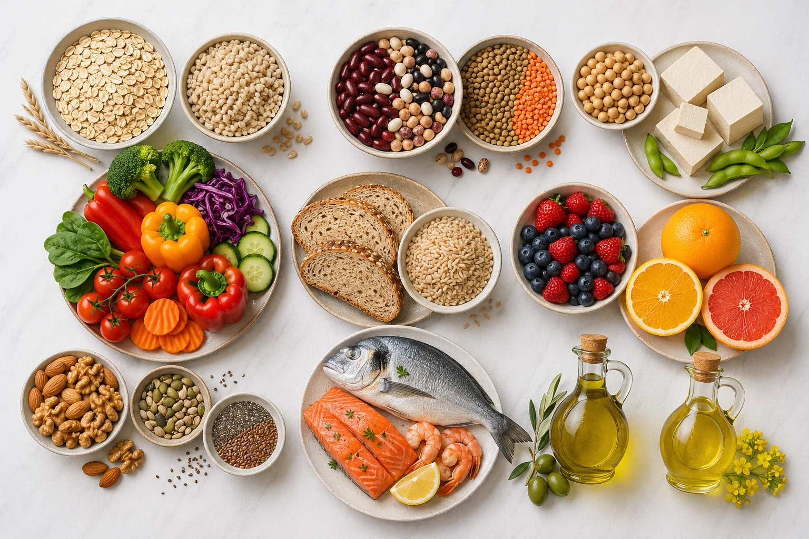
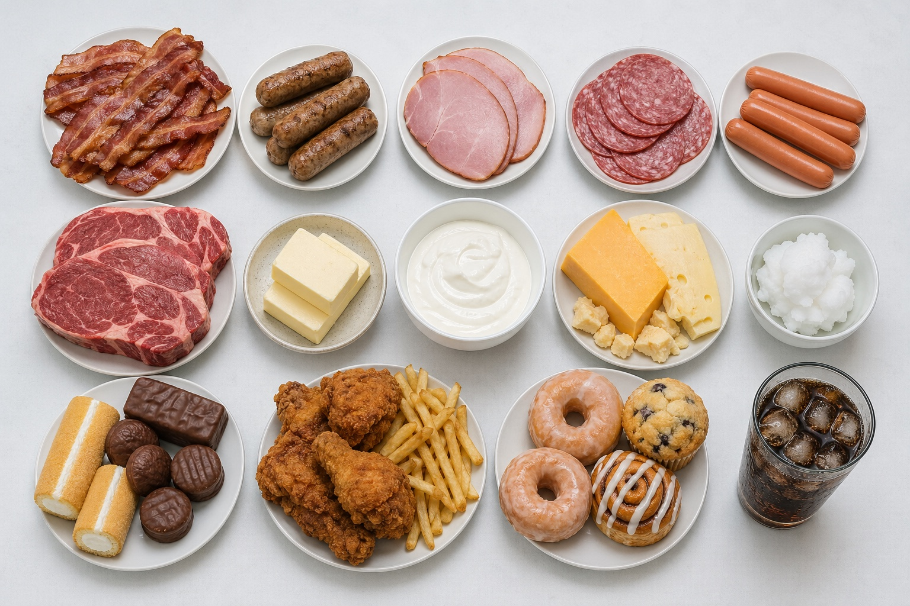
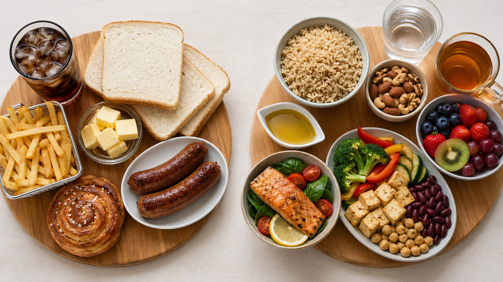

先把地中海飲食想成一種「地中海沿岸的日常餐桌」，而不是一張很嚴格的菜單。早期被注意到的地區包括義大利、希臘和前南斯拉夫沿海一帶；餐桌上常見穀類、蔬菜、水果、橄欖油，也會吃魚和豆類，紅肉、奶油、甜點和大量乳製品比較少。<a href="#ref-10">[10]</a>

這份衛教適合 LDL-C（壞膽固醇）偏高、總膽固醇偏高，或想用飲食降低心血管疾病風險的民眾。地中海飲食不是「多吃油」或「只吃橄欖油」，而是一套食物替換法：多吃蔬菜、水果、全穀、豆類、堅果、魚類與液態植物油；少吃紅肉、加工肉、奶油、椰子油/棕櫚油、甜食、含糖飲料與高度加工食品。<a href="#ref-2">[2]</a><a href="#ref-4">[4]</a><a href="#ref-6">[6]</a>

## 從海邊餐桌到醫學線索

地中海飲食會被醫學界注意到，最早不是因為某個超級食物，而是因為一個很生活化的觀察：有些地方的人吃得比較簡單，血中膽固醇平均比較低，心肌梗塞也比較少。1950 年代，Ancel Keys 到不同國家做早期觀察，發現義大利、希臘等地中海沿岸地區的飲食，比較接近「植物性食物多、橄欖油常用、動物性脂肪少」的樣子。<a href="#ref-10">[10]</a>

後來，這個線索被帶進一個跨國長期追蹤計畫。Seven Countries Study 在 1958 年展開，追蹤 7 個國家、16 個中年男性族群，總共 12,763 人。研究團隊不是只問大家吃什麼，也量血中膽固醇、做身體檢查，並長期追蹤心臟病發生與死亡，才慢慢把「飲食內容、膽固醇、心血管疾病」串在一起看。<a href="#ref-9">[9]</a><a href="#ref-10">[10]</a>

所以，地中海飲食的重點不是「地中海的水土比較神奇」，而是那種餐桌剛好符合我們現在對血脂控制的理解：少一點動物性脂肪和甜食，多一點蔬菜、全穀、豆類、魚類、堅果和液態植物油。後續回顧也指出，不同族群心臟病死亡率的差異，和平均膽固醇差異有很大關係。<a href="#ref-10">[10]</a><a href="#ref-9">[9]</a>

## 最重要的一句話

> 如果目標是降 LDL-C，請把地中海飲食做成「高纖維、偏植物性、低飽和脂肪」的版本。

ACC 的 LDL-C 飲食實務文章提醒：有些地中海飲食對 LDL-C 可能幾乎沒有影響，較偏植物性、低飽和脂肪的版本才比較可能降低 LDL-C。<a href="#ref-4">[4]</a>

WHO 建議成人與兒童把飽和脂肪降到總熱量 10% 以內，反式脂肪降到總熱量 1% 以內；若是以 LDL-C 控制為目標，ACC 文章引用 AHA/NLA 的第一線建議是飽和脂肪可限制到總熱量 7% 以下。<a href="#ref-5">[5]</a><a href="#ref-4">[4]</a>

## 2026 高血脂指引更新

2026 ACC/AHA 多學會高血脂指引已取代 2018 年血膽固醇指引，討論範圍也擴大到各種血脂異常，包含高膽固醇、高三酸甘油脂與 Lp(a) 偏高。新版仍強調生活型態是基礎，但更重視早期評估終身風險。<a href="#ref-7">[7]</a>

對民眾最實用的更新是：19 歲以上成人應做血脂檢查；每位成人至少做過 1 次 Lp(a) 檢測，若 Lp(a) 達 125 nmol/L 或 50 mg/dL 以上，屬於風險增強因子；男性 40 歲以上、女性 45 歲以上，若是否開始降膽固醇藥物仍不確定，可與醫師討論 CAC scan；醫療團隊也可能使用 PREVENT 估算未來 10 年與 30 年心血管風險。<a href="#ref-8">[8]</a>

新版病人訊息也提醒：膳食補充品不建議作為膽固醇管理方法；若需要藥物，飲食與運動仍要一起做，而不是二選一。<a href="#ref-8">[8]</a>

## 你的餐盤可以這樣改

每餐先放一半蔬菜，主食選糙米、燕麥、全麥麵、地瓜或其他全穀/原型澱粉；蛋白質優先選豆腐、豆乾、豆類、毛豆、魚、海鮮、去皮禽肉，紅肉和加工肉只當偶爾食物。AHA 指引把水果、蔬菜、全穀、植物性蛋白、魚與海鮮列為心血管健康飲食的核心。<a href="#ref-6">[6]</a>

油脂的做法是「換油」而不是「加油」。用橄欖油、芥花油、葵花油、黃豆油等液態植物油取代奶油、豬油、牛油、椰子油和棕櫚油；堅果可當點心或撒在沙拉上，但不要因為健康就無限制加量。<a href="#ref-4">[4]</a><a href="#ref-6">[6]</a>

纖維是 LDL-C 飲食裡很有用的主角。ACC 文章指出，最低建議量可用每 1,000 大卡 14 克纖維估算，約等於女性每天 25 克、男性每天 38 克；燕麥、大麥、豆類、蔬菜、水果和堅果都是可用來源。<a href="#ref-4">[4]</a>

魚類可以固定安排，每週至少 2 餐魚類是 AHA 飲食指引支持的模式；若不吃魚，可以把重點放在豆類、全穀、堅果、種子與液態植物油，並和營養師討論是否需要其他營養補充。<a href="#ref-6">[6]</a>

## 少吃什麼，比多買補品更重要

想降 LDL-C，最該優先減少的是飽和脂肪與反式脂肪。常見來源包括肥肉、五花肉、香腸、培根、火腿、奶油、鮮奶油、全脂乳製品、椰子油、棕櫚油，以及含部分氫化油或酥油的糕餅點心。<a href="#ref-4">[4]</a><a href="#ref-5">[5]</a>

不要把飽和脂肪換成白飯、白麵包、甜飲或甜點。WHO 的建議重點是用多元不飽和脂肪、植物來源單元不飽和脂肪，或含天然膳食纖維的全穀、蔬菜、水果、豆類來取代飽和脂肪。<a href="#ref-5">[5]</a>

## 研究告訴我們什麼

把許多研究放在一起看，地中海型飲食對心血管健康有幫助的訊號，但它不是「吃了膽固醇就會大降」的神奇飲食。對 LDL-C（壞膽固醇）來說，平均改善通常不算大，所以做法要抓對方向：高纖維、偏植物性、低飽和脂肪。<a href="#ref-1">[1]</a>

也有研究看到，採用地中海型飲食的人，後續心血管事件可能比較少；但研究者也提醒，資料仍有限，不能把它講成保證有效。比較穩當的理解是：它適合作為長期飲食方向，但不能取代必要的血脂追蹤與藥物評估。<a href="#ref-3">[3]</a>

因此，對高膽固醇民眾最務實的說法是：地中海飲食可以作為長期心血管風險管理的基礎，但若目標是明確降低 LDL-C，請把它做成低飽和脂肪、高纖維、少加工的版本，並定期回診追蹤血脂。<a href="#ref-4">[4]</a><a href="#ref-2">[2]</a>

## 一天範例

早餐：燕麥加無糖優格或豆漿，配水果和一小把堅果。午餐：糙米或全麥麵，加大量蔬菜、豆腐/魚肉，醬料少糖少鹽。晚餐：烤魚或豆類料理，搭配蔬菜、菇類、全穀主食；點心選水果、無調味堅果或毛豆。外食時，優先挑清蒸、烤、燉、滷，少選炸物、奶油白醬、酥皮和加工肉。<a href="#ref-4">[4]</a><a href="#ref-6">[6]</a>

## 什麼情況要特別回診

如果 LDL-C 很高、曾有心肌梗塞或中風、糖尿病、慢性腎臟病、家族性高膽固醇，或家族中有人年輕就發生心血管疾病，請不要只靠飲食觀察。

2026 ACC/AHA 多學會指引提醒，飲食與生活型態是基礎，但特定高風險或高 LDL-C 族群仍需要醫師評估藥物治療與追蹤。若三酸甘油脂高、代謝症候群或第 2 型糖尿病，ApoB（一種血脂相關指標）可能幫助判斷剩下的風險；若已經有心血管疾病且屬於極高風險，新版指引建議 LDL-C 目標可低於 55 mg/dL，這類情況不適合只靠衛教單自行調整。<a href="#ref-7">[7]</a><a href="#ref-8">[8]</a>

## 給自己的三個小目標

先從一餐開始，把白飯/白麵換成全穀，把香腸培根換成豆類或魚，把奶油/豬油換成液態植物油。接著每天增加一種蔬菜或豆類，每週固定安排魚類或豆類主菜。最後，把家裡常備點心換成水果、無調味堅果、無糖優格或毛豆。<a href="#ref-4">[4]</a><a href="#ref-6">[6]</a>

重點不是吃得像地中海國家，而是把每一天的選擇往「植物多一點、纖維多一點、飽和脂肪少一點、加工食品少一點」移動。這樣的地中海飲食，才是對膽固醇控制最有意義的版本。<a href="#ref-4">[4]</a><a href="#ref-5">[5]</a>

## 主要來源

<ol>
  <li id="ref-1">Rees K, et al. <a href="https://pmc.ncbi.nlm.nih.gov/articles/PMC6414510/">Mediterranean-style diet for the primary and secondary prevention of cardiovascular disease</a>. Cochrane Database Syst Rev. 2019.</li>
  <li id="ref-2">Arnett DK, et al. <a href="https://pmc.ncbi.nlm.nih.gov/articles/PMC7685565/">2019 ACC/AHA Guideline on the Primary Prevention of Cardiovascular Disease</a>. J Am Coll Cardiol. 2019.</li>
  <li id="ref-3">Liyanage T, et al. <a href="https://pmc.ncbi.nlm.nih.gov/articles/PMC4980102/">Effects of the Mediterranean Diet on Cardiovascular Outcomes</a>. PLoS One. 2016.</li>
  <li id="ref-4">American College of Cardiology. <a href="https://www.acc.org/Latest-in-Cardiology/Articles/2025/07/01/01/Prioritizing-Health-Dietary-Approaches-For-Elevated-LDL-C">Dietary Approaches For Elevated LDL-C</a>. 2025.</li>
  <li id="ref-5">World Health Organization. <a href="https://www.who.int/publications/i/item/9789240073630">Saturated fatty acid and trans-fatty acid intake for adults and children</a>. 2023.</li>
  <li id="ref-6">Lichtenstein AH, et al. <a href="https://www.ahajournals.org/doi/10.1161/CIR.0000000000001031">2021 Dietary Guidance to Improve Cardiovascular Health</a>. Circulation. 2021.</li>
  <li id="ref-7">American Heart Association. <a href="https://professional.heart.org/en/science-news/2026-guideline-on-the-management-of-dyslipidemia/top-things-to-know">Top Things to Know: 2026 Guideline on the Management of Dyslipidemia</a>. Updated March 13, 2026.</li>
  <li id="ref-8">American Heart Association. <a href="https://professional.heart.org/en/science-news/-/media/31C986CF6C02449DB2C3A947BA45C271.ashx">Key Patient Messages: 2026 Guideline on the Management of Dyslipidemia</a>. 2026.</li>
  <li id="ref-9">Menotti A, Puddu PE. Potential Similarity of Serum Cholesterol Multivariate Coefficients in the Prediction of Coronary Heart Disease Across Populations: A Review From the Seven Countries Study. <a href="https://europepmc.org/article/MED/41789338">Reviews in Cardiovascular Medicine</a>. 2026.</li>
  <li id="ref-10">Menotti A, Puddu PE. Ancel Keys, the Mediterranean Diet, and the Seven Countries Study: A Review. <a href="https://europepmc.org/article/MED/40278200">Journal of Cardiovascular Development and Disease</a>. 2025.</li>
</ol>
